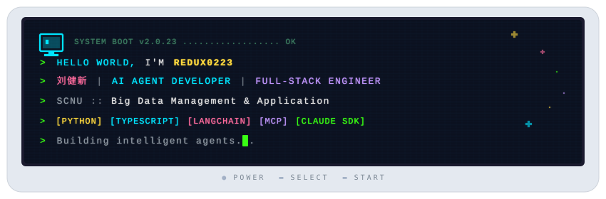

<div align="center">
  
</div>

<br/>

<div align="center">
  <a href="https://github.com/Redux0223?tab=followers">
    
  </a>
  &nbsp;
  <a href="https://github.com/Redux0223?tab=repositories&sort=stargazers">
    
  </a>
  &nbsp;
  <a href="https://profolio-dz5.pages.dev/">
    
  </a>
  &nbsp;
  
</div>

<br/>

<div align="center">
  
</div>

## `> whoami`

```
 ╔══════════════════════════════════════════════════════════════════╗
 ║  Name     : 刘健新 (Redux0223)                                  ║
 ║  Role     : AI Agent Developer & Full-stack Engineer            ║
 ║  School   : South China Normal University (SCNU)                ║
 ║  Major    : Big Data Management & Application                   ║
 ║  GPA      : 88/100 (3.8/5)                                     ║
 ║  Location : Guangzhou, China                                    ║
 ║  Email    : mrliu00@foxmail.com                                 ║
 ╠══════════════════════════════════════════════════════════════════╣
 ║  Building autonomous AI agents that automate complex workflows. ║
 ║  From e-commerce automation to AI-powered content generation,   ║
 ║  I ship products that drive real business outcomes.             ║
 ╚══════════════════════════════════════════════════════════════════╝
```

<div align="center">
  
</div>

## `> ls tech-stack/`

<table>
  <tr>
    <td align="center" width="150"><b>Languages</b></td>
    <td>
      
      
      
      
    </td>
  </tr>
  <tr>
    <td align="center"><b>AI / Agent</b></td>
    <td>
      
      
      
      
      
    </td>
  </tr>
  <tr>
    <td align="center"><b>Frontend</b></td>
    <td>
      
      
      
      
    </td>
  </tr>
  <tr>
    <td align="center"><b>Backend &<br/>Automation</b></td>
    <td>
      
      
      
      
    </td>
  </tr>
  <tr>
    <td align="center"><b>Tools</b></td>
    <td>
      
      
      
    </td>
  </tr>
</table>

<div align="center">
  
</div>

## `> cat projects.log`

<table>
  <tr>
    <td width="50%" valign="top">
      <h3><a href="https://github.com/Redux0223/ollama-chat">Shopify E-commerce Agent</a></h3>
      <p><b>Autonomous agent for e-commerce operations</b></p>
      <p>End-to-end pipeline: product sourcing -> data collection -> listing -> quality audit. Supervisor-Worker architecture handling 50+ SKUs with 99% accuracy. Drove GMV of 110K RMB across 3 stores.</p>
      <p>
        
        
        
        
      </p>
    </td>
    <td width="50%" valign="top">
      <h3><a href="https://hyper-ppt.vercel.app/">Hyper-PPT</a></h3>
      <p><b>AI-powered 3D presentation generator</b></p>
      <p>Architect-Worker pattern: 10 parallel agents generate 10 PPT slides in 180s (500%+ speedup). Self-healing code via AST analysis + LLM repair with 100% compilation rate. Built with React Three Fiber.</p>
      <p>
        
        
        
      </p>
    </td>
  </tr>
  <tr>
    <td width="50%" valign="top">
      <h3><a href="https://github.com/Redux0223/claudia">Claudia</a></h3>
      <p><b>GUI app & toolkit for Claude Code</b></p>
      <p>A powerful desktop application with custom agents, interactive sessions, and extended Claude Code capabilities.</p>
      <p>
        
        
      </p>
    </td>
    <td width="50%" valign="top">
      <h3><a href="https://github.com/Redux0223/ollama-chat">Ollama Chat</a></h3>
      <p><b>Desktop app for local LLM inference</b></p>
      <p>Clean desktop interface to run Ollama models locally. Local-first, privacy-focused AI chat experience.</p>
      <p>
        
        
      </p>
    </td>
  </tr>
</table>

<div align="center">
  
</div>

## `> neofetch`

<div align="center">
  
  &nbsp;
  
</div>

<br/>

<div align="center">
  
</div>

<br/>

<div align="center">
  
</div>

<div align="center">
  
</div>

## `> cat achievements.txt`

```
 ★  2023-2024  National Competition  ·····  1st Prize
 ★  2024-2025  National Competition  ·····  2nd Prize
 ★  CET-6  ···························  578
 ★  GMV Driven  ······················  ¥110,000+
```

<br/>

---

<div align="center">
  
</div>

<div align="center">
  <code>while (alive) { learn(); build(); ship(); repeat(); }</code>
  <br/><br/>
  <a href="mailto:mrliu00@foxmail.com">
    
  </a>
  &nbsp;
  <a href="https://profolio-dz5.pages.dev/">
    
  </a>
</div>
